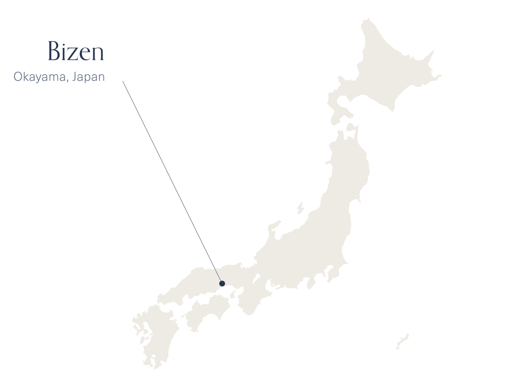

# Over more than 1,000 years

Bizen Pottery has been shaped *over more than 1,000 years*. Hailing from *the small village of Bizen* - one of the six ancient Japanese kilns - its artists have been refining their techniques ever since. While learning from their predecessors down a long lineage of dedicated artists, many younger Bizen artists have continued to challenge and adapted their techniques and aesthetics, building on this foundation of tradition and mastery.

## Tradition and modernity

Our selected artists are young and high-profile: promising artists with talented sensitivity that allows them to combine the traditional beauty of Bizen Pottery with modern influences.