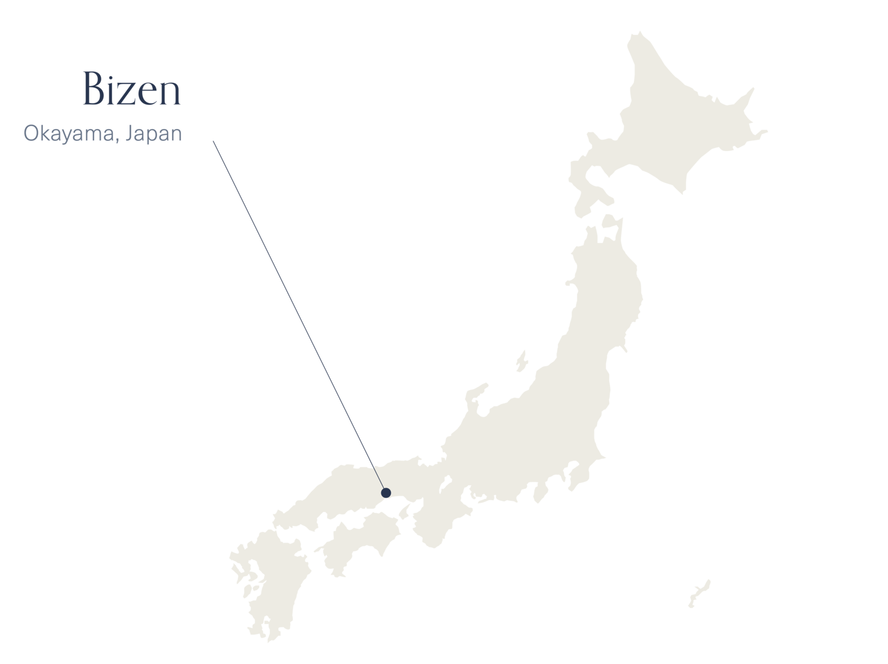

# Lebih dari 1.000 tahun

Tembikar Bizen telah dibentuk *selama lebih dari 1.000 tahun*. Berasal dari *desa kecil Bizen* - salah satu dari enam tempat pembakaran kuno di Jepang - para senimannya terus menyempurnakan teknik mereka sejak saat itu. Sambil belajar dari para pendahulu mereka dari berbagai generasi seniman yang berdedikasi, banyak seniman muda Bizen yang terus menantang dan mengadaptasi teknik dan estetika mereka, membangun fondasi tradisi dan penguasaan ini.

## Tradisi dan modernitas

Seniman pilihan kami adalah seniman muda dan terkenal: seniman menjanjikan dengan kepekaan berbakat yang memungkinkan mereka memadukan keindahan tradisional Tembikar Bizen dengan pengaruh modern.
